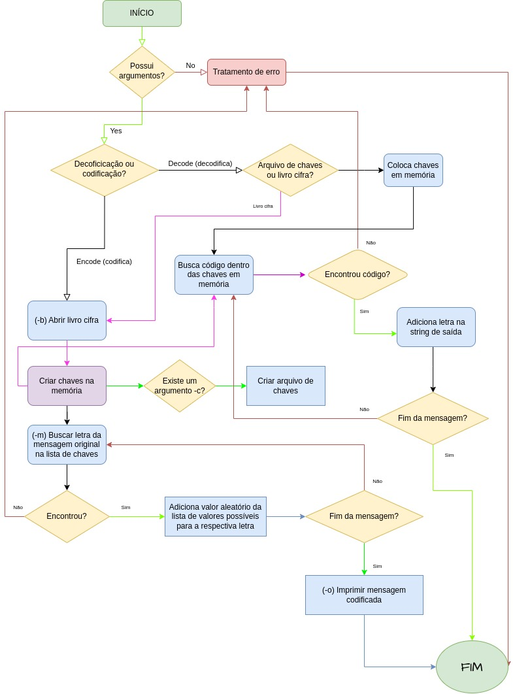

# Cifras de Beale

Aluna: Larissa Hey D'Andrade
GRR: 20196473

### Funcionalidades

#### Funções de codificação
[x] Receber input em arquivo
[x] Abrir livro cifra  
[x] Load chaves na memória  
[x] Cria arquivo de chaves  
[x] Busca letra da mensagem original na lista de chaves  

#### Funções de decodificação
[x] Carregar arquivo de chaves na memória  
[x] Load chaves na memória (livro cifra)  
[x] Busca código da chave na memória  
[x] Escrever em arquivo de saída

#### Outros requisitos
[x] Makefile
[x] Codificar letras que não existem no livro cifra
[x] Permitir que os comandos sejam inputados em diferentes ordens
[x] Compilar em C99

### Estrutura de dados
Para carregar as chaves em memória, foram criadas duas estruturas.
A estrutura principal é o vetor de dicionários de tamanho de 256 caracteres, enquanto que a outra é uma lista simplesmente ligada que contem todas as chaves correspondentes aquele caracter.
Dessa forma é possível acessar de maneira simples a letra desejada.

### Fluxograma
Os métodos criados foram feitos com objetivo de atender o seguinte fluxo:  

### Execução

#### Compilando*
    make beale  

#### Executando
##### *Codificar*
    ./beale  -e  -b LivroCifra -m MensagemOriginal -o MensagemCodificada -c ArquivoDeChaves

##### *Decodificar*
    ./beale  -d  -i MensagemCodificada  -c ArquivoDeChaves  -o MensagemDecodificada  
    ./beale -d -i MensagemCodificada -b LivroCifra -o MensagemDecodificada
